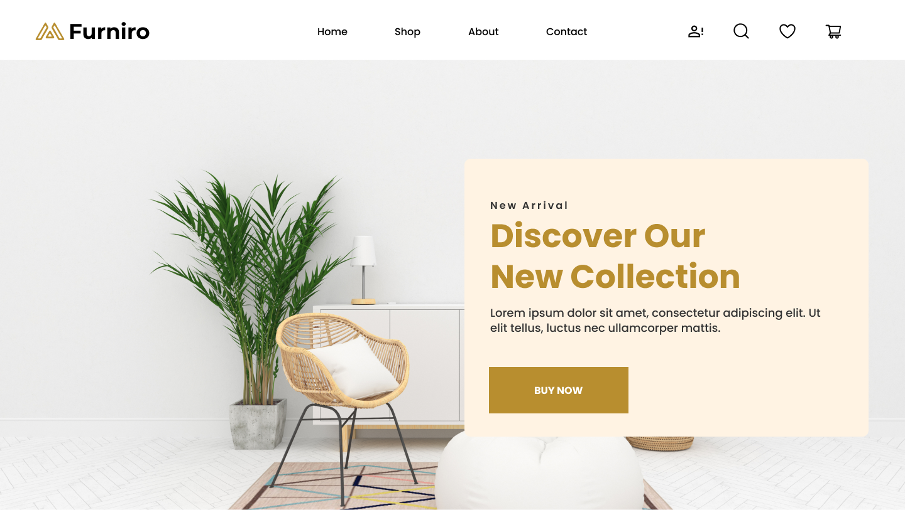

# Furniro

Discover our collection of furniture and home accessories. Find the perfect piece for your home.

## URL

https://furniro-three-smoky.vercel.app/

## Screenshots



## Features

- Responsive design
- Type-safe with TypeScript
- Accessibility optimized
- Modular component architecture
- Image optimization with Nuxt Image
- SEO optimized with Nuxt SEO
- Font optimization with Nuxt Font
- Icon optimization with Nuxt Icon

## Tech Stack

- **Framework**: Nuxt 3
- **Styling**: SCSS
- **Language**: TypeScript
- **Package Manager**: pnpm

## Project Setup

Make sure to install dependencies:

```bash
pnpm install
```

## Development Server

Start the development server on `http://localhost:3000`:

```bash
pnpm dev
```

## Production

Build the application for production:

```bash
pnpm build
```

Locally preview production build:

```bash
pnpm preview
```

## Development Guidelines

- Keep components small and reusable
- Use SCSS variables and mixins for consistency
- Follow BEM naming convention for CSS classes
- Ensure accessibility with semantic HTML elements
